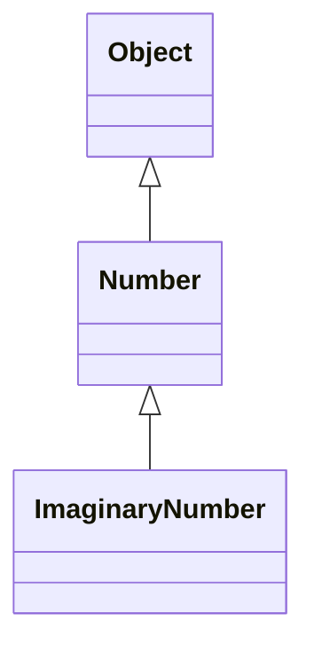

# 2023. 5. 10

1. 자바 객체
2. 자바 메소드 반환값
3. 자바 `this`
4. 자바 접근제한자

## 자바 객체

- 자바 프로그램은 많은 수의 객체를 만들며 객체끼리는 메소드를 통해 상호작용함
- 객체간의 상호작용을 통해서 프로그램은 다양한 일을 할 수 있음(GUI, 네트워킹 등)
- 객체가 작업을 완전히 완료하면 객체가 점유한 리소스는 다른 객체가 쓸 수 있도록 재활용됨

### 객체 생성

클래스는 객체의 설계도에 해당함

다음은 객체를 생성하는 일반적인 자바 코드

```java
Point originPoint = new Point(23, 94);
Rectangle rectOne = new Rectangle(originPoint, 100, 200);
Rectangle rectTwo = new Rectangle(50, 100);
```

위 코드는 객체를 생성하는 문으로 크게 3가지로 구분됨

1. 변수 선언: 객체의 타입에 맞는 변수 선언(레퍼런스 타입)
2. 객체 생성: `new` 연산자를 통한 객체 생성
3. 객체 초기화: `new` 연산자 다음에 오는 생성자 호출

### 객체 참조 변수

일반적인 변수 선언은 다음과 같음

```java
// 타입 변수명;
// 기본 데이터 타입 (primitive type)
int num;

// 참조 타입 (reference type)
Point point;

// 참조 타입에 객체 할당
point = new Point();
```

- 변수 선언은 컴파일러에 특정 변수명으로 특정 타입의 데이터를 참조한다는 것을 알리는 것과 같음
- 기본 데이터 타입 변수의 선언에서는 타입에 따라 적절한 메모리 공간도 예약함
- 레퍼런스 타입 변수의 선언은 실제 객체를 생성하지는 않음
  - 레퍼런스 타입 변수를 선언만 한 것은 변수가 어떤 객체도 참조하지 않는 것과 같음
  - 객체를 쓰기 전에 `new` 연산자를 사용해서 객체를 할당한 뒤 써야함
- 하나의 생성된 객체를 여러 레퍼런스 타입의 변수가 참조할 수 있음

### 클래스 인스턴스화

객체 생성을 위해 쓰는 `new` 연산자는 크게 두가지 일을 함

1. 객체를 위한 메모리를 할당하고 해당 메모리에 대한 참조를 반환
2. 객체의 생성자를 호출

> 객체 생성과 클래스 인스턴스화는 같은 의미

`new` 연산자

- `new` 연산자에는 뒤따르는 피연산자로 생성자가 필요함
- `new` 연산자가 반환하는 참조를 꼭 변수에 할당하지 않아도 됨 아래처럼 사용하는 것도 가능
```java
int height = new Rectangle().getHeight();
```

### 객체 초기화

- 객체 초기화는 클래스에 정의된 생성자를 통해 이루어짐
- 생성자는 형식은 반환 타입이 없고 클래스와 이름이 같음
    ```java
    class Point {
        public Point() { ... }
    }
    ```
- 생성자도 중복정의가 가능하며 시그니처가 달라야함
    ```java
    class Rectangle {
        public Rectangle() { ... }
        public Rectangle(int x, int y) { ... }
        public Rectangle(Point origin, int x, int y) { ... }
    }
    ```
- 컴파일러는 인수의 타입과 개수로 호출할 생성자를 결정함
- 모든 클래스는 반드시 하나 이상의 생성자가 있어야 함
  - 생성자를 선언하지 않는 경우 컴파일러가 자동으로 인수가 없는 기본 생성자를 만듬
  - 기본 생성자는 상위 타입의 기본 생성자를 호출함
  - 상위 타입이 없는경우 `Object` 타입의 기본 생성자를 호출함
  - 기본 생성자를 쓰기 위해서는 상위 타입에도 기본 생성자가 있어야 하며 상위 타입에 기본 생성자가 없는 경우 컴파일 에러

### 객체 사용

객체 생성 이후 해당 객체의 필드를 변경 또는 사용하거나 객체의 메소드를 호출할 수 있음

객체 필드

- 객체 필드는 객체 필드의 이름으로 접근할 수 있음
- 클래스 내에서 필드를 사용할 때는 간단하게 필드 이름만으로 접근할 수 있음
- 외부에서 사용할 때는 객체이름과 `.` 연산자 그리고 필드이름으로 접근할 수 있음
```java
class Rectangle {
    int height;
    // 클래스 내에서는 필드 이름만으로 접근
    public void method() {
        System.out.println(height);
    }
}

class Main {
    public static void main(String[] args) {
        Rectangle rect = new Rectangle();
        // 외부에서 객체 필드에 접근할 때는 . 연산자 사용
        System.out.println(rect.height);
    }
}
```

- 객체 필드는 객체 내에 존재하기 때문에 외부에서 접근할 때 객체이름 없이 단순히 필드로 접근하려는 것은 아무 의미가 없고 컴파일 에러를 발생시킴
- 객체의 필드는 객체마다 고유하기 때문에 객체의 참조 변수 이름을 통해 각각의 객체 필드에 접근할 수 있음
  - `new` 연산자는 객체 참조를 반환하기 때문에 참조 변수에 할당하지 않고도 객체를 참조할 수 있음
```java
// new 연산자에서 바로 객체 참조
int height1 = new Point().getHeight();

// 참조 변수에 할당 후 참조
Point point = new Point();
int height2 = point.getHeight();
```

단 객체 참조를 별도의 변수에 저장하지 않고 쓰는 경우 해당 명령문 이후에 해당 객체 참조를 더이상 사용할 수 없음

### 객체 메소드 호출

- 객체 참조를 통해 메소드를 호출할 수 있음
- 객체 참조에 `.` 연산자와 메소드 이름 `()`을 통해 호출가능하며 `()` 사이에는 메소드에 넘길 인수를 전달할 수 있음
    ```java
    someObj.method(); // 인수 없이 메소드 호출
    someObj.methodWithArg(10, 20); // 인수를 넘기며 메소드 호출
    ```
- 객체 필드 참조와 마찬가지로 `new` 연산자가 반환하는 참조에서 바로 메소드를 호출할 수 도 있음
- 메소드에 반환값이 있는 경우 표현식 자체에 메소드 호출을 사용할 수 있음
- 변수에 값을 할당하는 표현식에 메소드 호출을 사용하면 다음과 같음
  ```java
  int area = new Rectangle(50, 100).getArea();
  ```
- 특정 객체에 메소드를 호출하는 것을 "메시지를 보낸다"라고 표현함

### 가비지 컬렉터

- 일부 OOP 기반 언어는 생성된 객체를 명시적으로 소멸시켜야하는 경우가 있으며 이는 오류가 발생하기 쉬움
- 자바는 개발자가 시스템이 허용하는 범위 내에서 자유롭게 객체를 생성하고 더 이상 사용되지 않는 객체는 자동으로 처리해줌 이것을 가비지 컬렉션이라함
- 객체가 더이상 참조되지 않으면 가비지 컬렉션 대상이됨
  - 객체를 참조하는 변수가 범위를 벗어나서 없어지거나 명시적으로 참조변수에 `null` 을 할당하면 객체 참조가 사라짐
  - 하나의 객체를 여러 곳에서 참조할 수 있으므로 가비지 컬렉션 대상이 되려면 모든 참조가 없어야 함을 주의
- 가비지 컬렉션은 가비지 컬렉터에 의해 자동으로 발생함

## 자바 메소드 반환값

메소드는 다음 3가지 경우에 자신을 호출한 코드로 제어가 돌아가며 하나라도 먼저 발생하면 제어가 돌아감

- 메소드의 모든 실행문이 완료됨
- `return` 에 도달함 (값 반환을 할 수 있음)
- 예외를 던짐

### 메소드 반환값

- 메소드 시그니처에 명시한 반환타입이 `void` 가 아닌 경우 `return` 문에서 값을 반환할 수 있음
- 반환타입이 `void` 인 경우 `return` 문은 선택사항이지만 메소드를 종료하기 위해 `return` 문을 사용할 수 있음
- 반환타입이 `void` 가 아닌 경우 `return` 문을 포함해야함
  - `return` 문에서 반환하는 값은 반환타입과 같아야 함
  ```java
  // 메소드 반환타입이 int 이므로 return 문에서 반환하는 값도 int 타입이어야 함
  public int getNum() {
      return 10;
  }
  ```

### 레퍼런스 타입 반환값

- 메소드의 반환타입은 레퍼런스 타입도 가능
- 레퍼런스 타입의 반환값은 메소드 반환타입과 같은 타입이거나 하위 타입이어야 함

다음과 같이 `Object`, `Number`, `ImaginaryNumber` 계층구조가 형성된다고 가정



```java
public Number returnNumber() {
    ...
}
```

- 이 메소드는 `Number` 타입또는 `Number` 하위 타입을 반환할 수 있음
- `Object` 타입은 반환할 수 없음
- 하위 타입을 반환할 수 있는 것을 공변 반환 타입이라 함, 별도의 타입 캐스팅 없이도 하위 타입일 경우 그냥 반환할 수 있음
- 이러한 특징은 인터페이스에도 동일하게 적용됨

## 자바 `this`

- `this` 는 현재 객체를 가리키는 참조로 인스턴스 메소드나 생성자에서 쓸 수 있음
- 현재 객체는 해당 메소드또는 생성자가 호출되는 객체를 말함
- `this` 를 쓰면 인스턴스 메소드, 생성자에서 현재 객체의 모든 멤버를 참조할 수 있음

### 메소드 매개변수와 `this`

다음과 같은 상황에서 `this` 키워드는 유용함

```java
public class Point {
    int x; 
    int y;

    public Point(int x, int y) {
        this.x = x;
        this.y = y;
    }
}
```

- 메소드의 매개변수와 필드가 이름이 같은경우 메소드 내에서 해당 이름은 매개변수를 가리키게 됨
- 이 때 필드에 참조하기 위해 `this` 와 `.` 연산자를 사용할 수 있음

### 생성자에서 `this`

생성자 내에서 `this` 를 이용해서 다른 생성자를 명시적으로 호출할 수 있음

```java
public class Rectangle {
    private int x, y;
    private int width, height;

    public Rectangle() { ... }

    // this()를 통해서 다른 생성자를 호출함
    public Rectangle() {
        this(0, 0, 1, 1);
    }

    public Rectangle(int width, int height) { ... }

    public Rectangle(int x, int y, int width, int height) { ... }
}
```

- 생성자 내에서 `this()` 를 통해 다른 생성자를 호출할 때에도 메소드 호출과 마찬가지로 컴파일러는 인수의 타입과 개수를 보고 적절한 생성자를 호출함
- 생성자에서 다른 생성자를 호출할 때는 반드시 생성자의 가장 첫줄에 `this(...)`가 와야함

## 자바 접근제한자

- 접근 제한자(access modifier)는 다른 클래스가 특정 필드 또는 메소드를 사용할 수 있는지 결정함
- 접근 제한은 크게 두 레벨로 구분됨
  - 최상위 레벨 접근 제한 (`public`, `package-private`)
  - 멤버 레벨 접근 제한 (`public`, `protected`, `private`, `package-private`)
- 접근 제한은 다른 소스코드의 클래스를 가져올 때 어디까지 사용할 수 있는가와 새로운 클래스를 정의할 때 어디까지 공개할 것인가를 결정하는 방식으로 프로그램에 영향을 줌

### 최상위 레벨 접근 제한

- `public` 으로 선언된 클래스는 모든 클래스에서 접근할 수 있음
- `package-private` 클래스에 접근 제한자가 없는 경우이며 해당 클래스와 동일 패키지내에서만 접근할 수 있음 (다른 말로 `default`)

### 멤버 레벨 접근 제한

- `public` 으로 선언된 멤버는 모든 클래스에서 접근할 수 있음
- `package-priavte` 클래스에 접근 제한자가 없는 경우이며 해당 클래스와 동일 패키지내에서만 멤버에 접근할 수 있음
- `private` 으로 선언된 멤버는 해당 클래스 내에서만 접근할 수 있음
- `protected` 로 선언된 멤버는 해당 클래스, 동일 패키지, 하위 타입(타 패키지여도 무관)에서 접근할 수 있음

### 접근 제한 설정 가이드

접근 제한을 통해 작성한 클래스를 다른 개발자가 사용할 때 발생할 수 있는 오류를 막는것이 좋음 

- 멤버에 대해 가장 제한적인 접근 제한을 설정할 것, 특별한 이유가 없다면 `private`
- 상수를 제외하면 필드를 `public` 으로 설정하지 말 것
  - `public` 필드는 사용자와 실제 구현을 강하게 연결해서 코드의 유연성을 떨어뜨리는 경향이 있음
