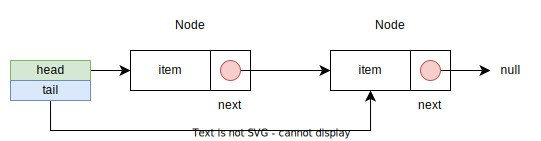

# 연결 리스트의 개념

연결 리스트는 리스트를 구성하는 노드를 링크로 연결한 자료구조를 말한다. 일반적으로 노드는 저장할 값과 다른 노드에 대한 링크를 가진다.

연결 리스트의 일반적인 형태는 다음과 같다. head는 리스트의 처음 노드를 가리키며 tail은 끝 노드를 가리킨다.



## 노드

노드는 연결 리스트의 구성 요소로 저장할 값과 다른 노드에 대한 링크(포인터)를 가진다. 연결 리스트에 요소를 추가/삭제할 때는 노드 단위로 메모리 할당/해제가 일어난다.

## 연결 리스트 연산

연결 리스트는 순서를 가지는 자료구조로 저장된 노드들이 일렬로 나열된 형태이다. 일반적으로 지원해야하는 연산은 다음과 같다.

- 리스트의 생성
- 리스트가 비어있는지 확인
- 리스트내의 원소 개수 확인
- 리스트에 요소 추가
  - 리스트의 처음에 요소 추가
  - 리스트의 끝에 요소 추가
  - 리스트의 중간에 요소 추가
- 리스트의 특정 요소 제거
- 리스트의 특정 요소 존재여부 확인
- 리스트 내 요소에 접근하기 위한 반복자 제공

### 연결 리스트 인터페이스

연결 리스트가 지원해야할 연산을 기반으로 자바 인터페이스 `MyList` 작성하면 다음과 같다. 리스트의 요소에 접근할 반복자를 제공할 수 있도록 `Iterable` 인터페이스를 상속한다.

```java
public interface MyList<E> extends Iterable<E> {
    
    boolean isEmpty();
    
    int size();
    
    void addFirst(E e);
    
    void addLast(E e);
    
    void addAfter(E target, E e);
    
    E remove(E target);
    
    boolean contains(E e);
}
```

## 시간 복잡도

연결 리스트의 일부 연산에 걸리는 시간 복잡도는 다음과 같다.

- 특정 노드에 접근 $O(n)$
  - 첫 노드, 끝 노드에 대한 참조를 유지하는 경우에 해당 노드에 접근하는 시간 복잡도 $O(1)$
- 특정 노드를 검색 $O(n)$
- 노드의 삽입, 삭제 $O(1)$ (삽입 위치나, 삭제 대상을 찾는 시간은 고려하지 않는다.)

연결 리스트에서 특정 노드에 접근하기 위해서는 해당 노드를 순차적으로 접근해야 하므로 비효율적인 편이다. 그러나 노드의 삽입, 삭제 연산은 링크만 변경하면 되므로 매우 효율적이다.

## 연결 리스트 vs 배열

연결 리스트는 노드 간의 연결로 구성되는 특성 때문에 배열과 메모리 사용에 있어서 몇 가지 차이점이 있다.

### 메모리 할당

배열은 최초 할당 시 전체 배열의 크기만큼 메모리를 할당받으며 크기가 고정된다. 만약 배열의 크기를 변경하려면 새로 메모리를 할당받아야 한다.

연결 리스트는 새로운 요소를 추가할 때 마다 노드 단위로 메모리를 할당받는다. 따라서 연결 리스트의 크기는 요소를 추가하거나 제거할 때 마다 동적으로 변한다.

이러한 차이로 인해 연결 리스트는 배열에 비해 삽입, 삭제 연산이 용이하다. 배열은 남는 공간을 줄이거나 추가 공간을 쓰기 위해 메모리를 다시 할당받고 요소들을 옮겨주어야 한다.(시간 복잡도 $O(n)$) 그러나 연결 리스트는 단순히 새로운 노드를 추가하거나 기존 노드를 해제하고 링크만 다시 연결해주면 되기 때문이다. (시간 복잡도 $O(1)$)

### 요소들의 순서

연결 리스트와 배열을 메모리의 사용 방식이 다르기 때문에 요소들의 순서에 관한 부분에 차이가 있다.

배열의 경우 연속되는 메모리에 요소들이 저장되므로 물리적인 순서와 논리적인 순서가 일치한다. 그러나 연결 리스트는 단순히 노드 간의 링크로 순서가 표현되므로 물리적인 순서가 논리적 순서와 일치하지 않을 수 있다.

### 요소 접근

연결 리스트는 특정 노드를 찾기 위해서는 시작 노드부터 링크를 따라가야 하므로 임의 접근이 불가능하며 순차 접근을 통해야 한다.

배열은 같은 타입의 요소들이 메모리상 연속되는 공간에 할당되기 때문에 타입의 크기와 요소의 인덱스를 통해 주소를 계산해서 특정 메모리에 한번에 접근할 수 있다. 즉 임의 접근이 가능하다.

## Reference

- c로 배우는 쉬운 자료구조 - 이지영