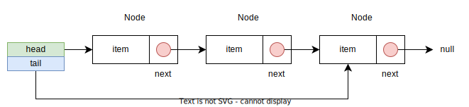
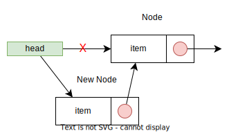
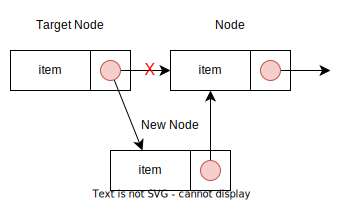
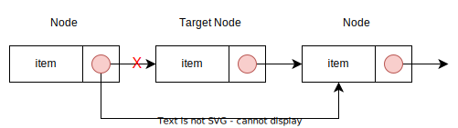

# 단일 연결 리스트 구현

[전체 소스코드](https://github.com/jeonseun/til-code/blob/main/data-structure/src/main/java/me/seun/list/SinglyLinkedList.java)

단일 연결 리스트는 리스트를 구성하는 노드의 링크가 하나인 연결 리스트를 말한다. 형태는 다음과 같다.



모든 구현은 [연결 리스트의 개념](../data-structure/linked-list-concept.md)에서 정의한 `MyList` 인터페이스를 구현하는 것을 기준으로 한다.

## 노드 정의

단일 연결 리스트는 자신의 다음 노드만 가리키기 때문에 하나의 링크와 저장할 값을 가지면 된다. java 코드로 작성하면 다음과 같다.

```java
public class SinglyLinkedList<E> implements MyList<E> {
    private Node<E> head; // 첫 노드를 가리킬 참조

    private Node<E> tail; // 끝 노드를 가리킬 참조

    private static class Node<E> {
        E item;
        Node next;

        Node(E item, Node next) {
            this.item = item;
            this.next = next;
        }
    }
}
```

## 삽입 연산

리스트에 요소를 추가하는 연산은 추가하는 위치에 따라 3가지로 구분할 수 있다.

- 리스트 처음에 요소 추가
- 리스트 중간에 요소 추가
- 리스트 끝에 요소 추가

3가지 연산 모두 삽입 연산을 시작하는 위치만 다를 뿐 맥락은 거의 같다. 단 노드가 이미 존재하는 상태에서 추가하는 경우 노드의 링크가 끊어지지 않도록 주의해야 한다.

### 리스트 처음에 요소 추가

리스트의 처음에 요소를 추가하는 것은 head가 가리키는 노드만 확인하면 된다. head가 가리키는 노드가 있는 경우 새 노드의 링크를 head가 가리키는 노드로 변경하고 head가 새 노드를 가리키도록 하면된다.



만약 head가 가리키는 노드가 없는 경우 간단하게 head가 새 노드를 가리키도록 하면 된다. 더해서 마지막 노드를 가리키는 tail을 별도로 유지하는 경우 tail이 새 노드를 가리키도록 해야한다.

```java
@Override
public void addFirst(E e) {
    Node<E> newNode = new Node<>(e, null);
    if (head == null) {
        head = newNode;
        tail = newNode;
        return;
    }

    Node<E> temp = head;
    head = newNode;
    newNode.next = temp;
}
```

head가 가리키는 노드가 있을 경우 해당 노드를 따로 임시 변수에 저장해두는 것에 주의하자.

### 리스트 중간에 요소 추가

리스트의 중간(특정 노드의 뒤)에 요소를 추가하기 위해서는 대상 노드를 찾고 링크를 다시 연결해주는 작업이 필요하다. head부터 링크를 타고가서 대상 노드를 찾으면 대상 노드의 다음 노드를 새 노드와 연결시킨 후 대상 노드의 기존 링크를 새 노드로 변경해주면 된다.



대상 노드를 찾기 위해 임시 변수 cur을 써서 링크를 타고간다. 찾으면 노드 간 링크를 다시 연결해주면 된다. 만약 대상 노드를 못 찾는 경우 예외를 발생 시키는 것에 유의하자. 또한 리스트 자체가 비어있을 경우 애초에 연산을 수행할 필요가 없으므로 연산에 앞서서 리스트가 비어있는지 확인해야 한다.

```java
@Override
public void addAfter(E target, E e) {
    validateEmptyList(); // 리스트가 비어있으면 예외를 발생시키도록 구현

    Node<E> cur = head;

    while (cur != null && !cur.item.equals(target)) {
        cur = cur.next;
    }

    if (cur == null) {
        throw new NoSuchElementException();
    }
    cur.next = new Node<>(e, cur.next);
}
```

### 리스트 끝에 요소 추가

리스트 끝에 요소를 추가하는 것은 단순히 끝 노드를 가리키는 tail의 다음 노드를 새 노드로 연결하면 된다. 만약 tail을 별도로 유지하지 않는 경우 head 부터 다음 노드가 null인 노드(즉 끝 노드)까지 링크를 타고 가면되고 빈 리스트인 경우, 즉 head가 null인 경우 head에 바로 연결해주면 된다.

```java
@Override
public void addLast(E e) {
    Node<E> newNode = new Node<>(e, null);
    if (head == null) {
        head = newNode;
        tail = newNode;
        return;
    }
    tail.next = newNode;
    tail = newNode;
}
```

## 삭제 연산

리스트의 요소 삭제는 삭제할 대상 요소를 찾고 해당 요소의 앞 뒤의 노드의 링크를 서로 연결해주면 된다.



만약 head가 가리키는 노드가 대상이 될 경우 head의 링크를 대상 노드의 다음 노드로 연결하면 되고 이외의 경우에는 대상 노드를 링크를 타고가며 찾아야 한다. 이 때 대상 노드를 없애려면 대상 노드의 이전 노드에서 링크를 변경해주어야 하므로 cur, prev 두 개의 임시 변수를 사용한다.

```java
@Override
public void remove(E target) {
    validateEmptyList();

    if (head.item.equals(target)) {
        head = head.next;
        return;
    }

    Node<E> prev = head;
    Node<E> cur = head.next;

    while (cur != null) {
        if (cur.item.equals(target)) {
            prev.next = cur.next;
            return;
        }
        prev = cur;
        cur = cur.next;
    }

    throw new NoSuchElementException();
}
```

대상 노드를 찾는 경우 간단하게 이전 노드의 링크를 대상 노드의 다음 노드로 연결시키면 된다. 이렇게 하면 대상 노드에 대한 참조가 사라지고 자바 기준에서 unreachable한 객체가 되므로 gc의 대상이 된다.

## 빈 리스트 확인 연산

리스트가 비어있는지 확인하는 방법은 head가 null인지 확인하면 된다. 하나라도 요소가 추가된 경우 head는 특정 노드를 가리키므로 null일 수 없다.

```java
@Override
public boolean isEmpty() {
    return head == null;
}
```

## 리스트 내 특정 요소의 존재 여부 확인 연산

리스트 내의 특정 요소의 존재 여부를 확인하려면 순차 접근을 통해 일치하는 요소를 찾아야 한다. 리스트가 비어있는 경우 특정 요소를 찾을 필요도 없으므로 다른 작업에 앞서서 확인해주면 된다.

임시 변수 cur을 써서 head부터 순차적으로 링크를 타고가며 대상을 찾는다. 대상이 있는 경우 반복을 멈추도록 조건식을 작성하면 대상이 있는 경우엔 cur이 대상 노드를 참조하고 대상이 없는 경우 cur이 null이 되므로(대상을 찾지 못해 링크를 끝까지 타고갔으므로) 이 점을 이용해 존재 여부를 확인하면 된다.

```java
@Override
public boolean contains(E e) {
    validateEmptyList();

    Node<E> cur = head;

    while (cur != null && !cur.item.equals(e)) {
        cur = cur.next;
    }

    return cur != null;
}
```

## 리스트 사이즈 확인 연산

사이즈를 확인하는 방법은 심플하게 접근하면 head부터 마지막 노드까지 링크를 타고가며 개수를 세는 것이다. 그러나 별도의 size 변수를 유지하는 경우 리스트의 요소 삽입, 삭제마다 size 변수의 값을 증감 시키도록 구성하여 단순히 size 변수의 값을 확인하는 것으로 리스트의 현재 사이즈를 계산할 수 있다.

## 리스트 반복자 제공

리스트의 모든 요소를 반복하기 위한 `Iterator` 구현체를 제공한다. 제공할 `Iterator` 구현체는 다음과 같다.

```java
public class SinglyLinkedList<E> implements MyList<E> {
    ...
    private static class SLLIteratorImpl<E> implements Iterator<E> {
        private Node<E> cur;

        public SLLIteratorImpl(Node<E> cur) {
            this.cur = cur;
        }

        @Override
        public boolean hasNext() {
            return cur != null;
        }

        @Override
        public E next() {
            E item = cur.item;
            cur = cur.next;
            return item;
        }
    }
}
```

단일 연결 리스트의 노드를 순회할 수 있도록 시작 노드인 head를 받아 cur 변수에 유지하면서 반복에 사용한다. 다음 요소의 유무는 cur의 값이 null인지 아닌지로 판한다고 다음 요소에 접근할 때마다 cur이 다음 노드로 이동하도록 구현한다.
