# 관계대수

관계대수 기본 개념 정리

## TOC

- [관계대수의 정의](#관계대수의-정의)
- [일반 집합 연산자](#일반-집합-연산자)
  - [합집합](#합집합)
  - [교집합](#교집합)
  - [차집합](#차집합)
  - [카티션 프로덕트](#카티션-프로덕트)
- [순수 관계 연산자](#순수-관계-연산자)
  - [셀렉트](#셀렉트)
  - [프로젝트](#프로젝트)
  - [디비전](#디비전)
  - [조인](#조인)
    - [세타 조인](#세타-조인)
    - [동등 조인](#동등-조인)
    - [자연 조인](#자연-조인)
    - [세미 조인](#세미-조인)
    - [외부 조인](#외부-조인)

 

## 관계대수의 정의

관계대수(relational algebra)는 관계 데이터 모델의 연산 중 하나로 원하는 데이터를 얻기 위한 데이터의 처리 과정을 순서대로 기술하는 절차적 언어(procedural language)이다.

관계대수의 특징

- 관계대수는 원하는 데이터를 얻기 위해 릴레이션을 처리하는 과정을 순서대로 기술하는 언어
- 관계대수의 피연산자는 릴레이션이며 연산 결과도 릴레이션(폐쇄적 특성)
- 일반 집합 연산자와 순수 관계 연산자로 구분

 

## 일반 집합 연산자

일반 집합 연산자는 수학의 집합 관련 연산자를 차용한 것으로 릴레이션이 튜플의 집합이라는 개념을 이용한 연산자이다.

일반 집합 연산자의 특징

- 일반 집합 연산자는 연산을 위해 2개의 피연산자가 필요함
- 합집합, 교집합, 차집합은 2개의 피연산자 릴레이션이 합병 가능 해야함
  - 합병 가능 조건 1 → 두 릴레이션의 차수가 같음
  - 합병 가능 조건 2 → 두 릴레이션에서 대응되는 속성의 도메인이 같음

일반 집합 연산자 종류

|     연산자      |   기호   | 표현         | 의미                                                       |
| :-------------: | :------: | :----------- | ---------------------------------------------------------- |
|     합집합      |  $\cup$  | $R \cup S$   | 릴레이션 R, S의 합집합 반환                                |
|     교집합      |  $\cap$  | $R \cap S$   | 릴레이션 R, S의 교집합 반환                                |
|     차집합      |   $-$    | $R - S$      | 릴레이션 R, S의 차집합 반환                                |
| 카티션 프로덕트 | $\times$ | $R \times S$ | 릴레이션 R, S의 튜플들을 모두 연결하여 만든 튜플 집합 반환 |

### 합집합

합집합(union)은 $R \cup S$로 표기하며 릴레이션 R과 S에 속하는 모든 튜플로 결과 릴레이션을 구성한다.

각각 학생을 나타내는 두 릴레이션 R, S

$R \cup S$

_릴레이션 R, S의 모든 튜플로 결과 릴레이션을 구성하며 중복해서 나오는 `(100, '정찬성')`의 경우 한 번만 나타난다._

합집합 특징

- 연산의 결과도 릴레이션 이므로 중복을 허용하지 않음, 따라서 중복되는 튜플이 있는 경우 한 번만 나타남
- $R \cup S$의 결과 릴레이션의 차수는 R, S의 차수와 같음
- $R \cup S$의 결과 릴레이션의 카디널리티는 R, S의 카디널리티를 더한 값보다 작거나 같음
- 교환 법칙과 결합 법칙이 성립함

### 교집합

교집합(intersection)은 $R \cap S$로 표기하며 릴레이션 R과 S에 공통으로 속하는 튜플로 결과 릴레이션을 구성한다.

각각 학생을 나타내는 두 릴레이션 R, S

$R \cap S$

_릴레이션 R, S이 공통으로 가진 `(100, '조인성')` 튜플로 결과 릴레이션을 구성한다._

교집합 특징

- $R \cap S$의 결과 릴레이션의 차수는 R, S의 차수와 같음
- $R \cap S$의 결과 릴레이션의 카디널리티는 R, S의 각각의 카디널리티 보다 작거나 같음
- 교환 법칙과 결합 법칙이 성립합

### 차집합

차집합(difference)는 $R - S$로 표기하며 릴레이션 R에는 존재하지만 S에는 존재하지 않는 튜플로 결과 릴레이션을 구성한다.

각각 학생을 나타내는 두 릴레이션 R, S

$R - S$와 $S - R$

_R - S는 릴레이션 R에는 존재하지만 S에는 존재하지 않는 `(200, '김민준')`, `(400, '이민서')` 튜플로 결과 릴레이션을 구성한다._  
_S - R은 릴레이션 S에는 존재하지만 R에는 존재하지 않는 `(700, '최도윤')` 튜플로 결과 릴레이션을 구성한다._

차집합 특징

- $R - S$, $S - R$의 결과 릴레이션 차수는 R, S의 차수와 같음
- 결과 릴레이션의 카디널리티는 R, S의 각각의 카디널리티 보다 작거나 같음
  - $R - S$는 R의 카디널리티 보다 작거나 같음
  - $S - R$는 S의 카디널리티 보다 작거나 같음
- 교환 법칙과 결합 법칙이 성립하지 않음

### 카티션 프로덕트

카티션 프로덕트(cartesian product)는 $R \times S$로 표기하며 릴레이션 R, S 각각의 튜플을 연결하여 결과 릴레이션을 구성한다.

각각 고객과 상품을 나타내는 릴레이션 R, S

$R \times S$

_$R \times S$는 릴레이션 R, S의 각 튜플을 모든 경우의 수로 조합하여 결과 릴레이션을 구성한다. 속성이름이 같은 경우 구분을 위해 `릴레이션이름.속성이름`으로 표기한다._

카티션 프로덕트 특징

- 두 릴레이션이 합병이 불가능해도 연산 가능
- $R \times S$의 결과 릴레이션의 차수는 R과 S의 차수의 합
- $R \times S$의 결과 릴레이션의 카디널리티는 R, S의 카디널리티의 곱
- 교환 법칙과 결합 법칙이 성립함

 

## 순수 관계 연산자

순수 관계 연산자는 릴레이션의 구조와 특성을 이용하는 연산자이다.

|  연산자  |   기호   | 표현                  | 의미                                                                  |
| :------: | :------: | :-------------------- | --------------------------------------------------------------------- |
|  셀렉트  | $\sigma$ | $\sigma_{조건식}(R)$  | 릴레이션 R에서 조건식을 만족하는 튜플을 반환                          |
| 프로젝트 |  $\pi$   | $\pi_{속성리스트}(R)$ | 릴레이션 R에서 선택한 속성들의 값으로만 구성된 튜플을 반환            |
|  디비전  |  $\div$  | $R \div S$            | 릴레이션 S의 모든 튜플과 관련이 있는 릴레이션 R의 튜플을 반환         |
|   조인   | $\Join$  | $R \Join S$           | 릴레이션 R, S의 튜플을 공통 속성을 기준으로 연결하여 만든 튜플을 반환 |

### 셀렉트

셀렉트(select)는 $\sigma_{조건식}(R)$로 표기하며 릴레이션 R의 튜플 중 조건식을 만족하는 튜플만 선택하여 결과 릴레이션을 구성한다.

고객을 나타내는 릴레이션 R

나이가 26세 이상인 고객만 찾아라 → $\sigma_{나이 \ge 26}(R)$

_해당 조건식을 만족하는 튜플만 선택하여 결과 릴레이션을 구성한다._

셀렉트 특징

- 조건식은 비교 연산자($\gt, \ge, \lt, \le, =, \ne$)를 이용해서 구성
- 논리 연산자를 사용하여 복잡한 조건식 구성 가능
  - $\land$ → and, 여러개의 조건식을 모두 만족해야 하는 경우
  - $\lor$ → or, 여러개의 조건식 중 하나만 만족해도 되는 경우
  - $\neg$ → not, 조건식을 만족하지 않아야 하는 경우
- 조건식을 만족하는 튜플만 선택하므로 릴레이션의 수평적 부분집합을 구하는 수평적 연산자
- 교환 법칙이 성립함

### 프로젝트

프로젝트(project)는 $\pi_{속성리스트}(R)$로 표기하며 릴레이션 R의 속성 중 속성리스트에 명시한 속성만으로 결과 릴레이션을 구성한다.

고객을 나타내는 릴레이션 R

고객의 고객이름, 등급, 마일리지 속성만 추출하라 → $\pi_{고객이름, 등급, 마일리지}(R)$

_릴레이션의 튜플에서 해당 속성리스트만 추출하여 결과 릴레이션을 구성한다._

프로젝트 특징

- 프로젝트 연산의 결과도 릴레이션이므로 동일한 튜플은 중복되지 않음
- 지정한 속성리스트만 선택하므로 릴레이션의 수직적 부분집합을 구하는 수직적 연산자

### 디비전

디비전(division)은 $R \div S$로 표기하며 릴레이션 S의 모든 튜플과 관련이 있는 R의 튜플로 결과 릴레이션을 구성한다.

각각 수강내역과 개설강좌를 나타내는 릴레이션 R, S

개설된 모든 강좌를 수강하는 학생을 찾아라 → $R \div S$

_릴레이션 R의 튜플 중 동일한 학생이름 기준으로 개설된 모든 강좌를 수강하는 학생의 튜플만 찾아서 결과 릴레이션을 구성한다. 따라서 3가지 개설강좌(`컴퓨터개론`, `알고리즘`, `자료구조`)를 모두 수강하는 `서지우`만 결과 릴레이션에 포함된다._

디비전 특징

- 디비전 연산의 결과도 릴레이션이므로 동일한 튜플은 중복되지 않음
- $R \div S$ 연산은 릴레이션 S의 모든 속성을 R이 포함해야 연산 가능
- $R \div S$에 대해 결과 릴레이션에는 릴레이션 S의 속성은 제외됨

### 조인

조인(join)은 $R \Join S$로 표기하며 관계가 있는 두 릴레이션을 조인 속성(join attribute)을 이용해 조합하여 하나의 결과 릴레이션을 구성한다. 조인 속성은 두 릴레이션의 관계를 나타내는 속성으로 릴레이션 R과 S가 공통으로 가진 속성을 말한다.

조인 특징

- 조인 연산의 결과도 릴레이션이므로 동일한 튜플은 중복되지 않음
- 관계가 있는 두 릴레이션에 공통으로 존재하는 조인 속성을 기준으로 수행됨

조인 종류

|   종류    |         기호         | 표현                                                                | 의미                                                                 |
| :-------: | :------------------: | :------------------------------------------------------------------ | -------------------------------------------------------------------- |
| 세타 조인 | $\Join_{A \theta B}$ | $R \Join_{A \theta B} S$                                            | 릴레이션 R, S의 조인 속성이 조건식을 만족하는 튜플끼리 결합하는 조인 |
| 동등 조인 |       $\Join$        | $R \Join S$                                                         | 세타 조인의 조건식이 동등 비교($=$)인 조인                           |
| 자연 조인 |     $\Join_{N}$      | $R \Join_{N} S$                                                     | 동등 조인의 결과에서 중복되는 속성이 제거되는 조인                   |
| 세미 조인 |      $\ltimes$       | $R \ltimes S$                                                       | 릴레이션 S의 조인 속성만 추출하여 R과 조인                           |
| 외부 조인 |      $⟕, ⟖, ⟗$       | $R \space ⟕ \space S$, $R \space ⟖ \space S$, $R \space ⟗ \space S$ | 조인 속성의 값이 `null`인 튜플도 포함하는 조인                       |

#### 세타 조인

세타 조인(theta join)은 $R \Join_{A \theta B} S$로 표기하며 각각 릴레이션 R, S의 조인 속성 $_{A, B}$에 대해 조건식($_\theta$)을 만족하는 튜플끼리 조합하여 결과 릴레이션을 구성한다. 조건식을 통해 비교가 가능해야 하므로 $_{A, B}$는 같은 도메인이어야 한다.

#### 동등 조인

동등 조인(equi join)은 $R \Join S$로 표기하며 릴레이션 R, S의 조인 속성이 같은 튜플끼리 조합하여 결과 릴레이션을 구성한다. 즉 세타 조인에서 조건식이 $=$인 경우를 말한다.

고객과 주문내역을 나타내는 릴레이션 R, S 조인 속성으로 고객아이디 속성이 사용된다.

각 고객이 주문한 정보를 찾아라 → $R \Join S$

_각 릴레이션에서 조인 속성인 고객번호가 같은 튜플끼리 조합해서 결과 릴레이션을 구성한다._

#### 자연 조인

자연 조인(natural join)은 $R \Join_{N} S$로 표기하며 릴레이션 R, S를 동등 조인한 결과 릴레이션에서 중복되는 속성을 제거하여 조인 속성이 한번만 나타나도록 한다.

_동등 조인 결과에는 조인 속성이 중복해서 나타난다._

각 고객이 주문한 정보를 찾고 중복된 속성을 제거하라 → $R \Join_{N} S$

_자연 조인 결과에는 조인 속성이 한번만 나타난다._

#### 세미 조인

세미 조인(semi join)은 $R \ltimes S$로 표기하며 릴레이션 S의 조인 속성만 추출(프로젝트)한 릴레이션을 R과 자연 조인하여 결과 릴레이션을 구성한다. 검색에 불필요한 속성을 미리 제거하여 조인 연산의 비용이 줄어들지만 교환 법칙이 성립하지 않으므로 $R \ltimes S$, $S \ltimes R$의 결과가 다르다.

고객과 주문내역을 나타내는 릴레이션 R, S에서 각 릴레이션의 조인 속성만 프로젝트한다.

주문한 내역이 있는 고객을 찾아라 → $R \ltimes S$  
대상 고객이 존재하는 주문내역을 찾아라 → $S \ltimes R$

_각각 상대 릴레이션의 조인 속성만 추출해서 연산하므로 $R \ltimes S$에는 릴레이션 R의 속성, $S \ltimes R$에는 릴레이션 S의 속성으로만 구성된다._

#### 외부 조인

외부 조인(outer join)은 두 릴레이션의 자연 조인에서 조인 속성 값이 `null`인 튜플, 즉 관계에 참여하지 않는 튜플을 결과 릴레이션에 포함하는 조인이다. 조인 결과에서 대응되는 튜플이 없는 경우 상대 릴레이션의 속성값은 `null`로 표기한다.

- 왼쪽 외부 조인(left outer join) → $R \space ⟕ \space S$, 관계에 참여하지 않는 R(왼쪽)의 튜플도 포함, 즉 릴레이션 R의 모든 튜플을 결과 릴레이션에 포함
- 오른쪽 외부 조인(right outer join) → $R \space ⟖ \space S$, 관계에 참여하지 않는 S(오른쪽)의 튜플도 포함, 즉 릴레이션 S의 모든 튜플을 결과 릴레이션에 포함
- 완전 외부 조인(full outer join) → $R \space ⟗ \space S$, 관계에 참여하지 않는 R, S(양쪽)의 튜플도 포함, 즉 릴레이션 R, S의 모든 튜플을 결과 릴레이션에 포함

각각 사원과 부서를 나타내는 릴레이션 R, S 조인 속성으로 부서번호 속성이 사용된다.

왼쪽 외부 조인 예: 소속 부서가 없는 사원도 포함하여 사원의 소속 부서를 찾아라 → $R \space ⟕ \space S$

_릴레이션 R의 `(500, '강동호', '과장', null)` 튜플은 부서번호 속성이 null로 소속된 부서가 없으나 왼쪽 외부 조인 연산의 결과 릴레이션에 포함된다._

오른쪽 외부 조인 예: 소속 사원이 없는 부서를 포함하여 부서별 소속 사원을 찾아라 → $R \space ⟖ \space S$

_릴레이션 S의 `(3, '재무')`, `(4, '영업')` 튜플은 R에 대응되는 부서 번호를 가진 사원이 없으나 오른쪽 외부 조인 연산의 결과 릴레이션에 포함된다._

완전 외부 조인 예: 소속이 없는 사원, 소속 사원이 없는 부서를 포하하여 사원, 부서의 소속 현황을 찾아라 → $R \space ⟗ \space S$

_각각 소속이 없고 소속 사원이 없는 `(500, '강동호', '과장', null)`, `(3, '재무')`, `(4, '영업')` 튜플이 완전 외부 조인 연산의 결과 릴레이션에 포함된다._

 

## Reference

- [데이터베이스 개론 3판 #ch6 - 김연희, 한빛출판네트워크](https://www.hanbit.co.kr/store/books/look.php?p_code=B6505632990)
