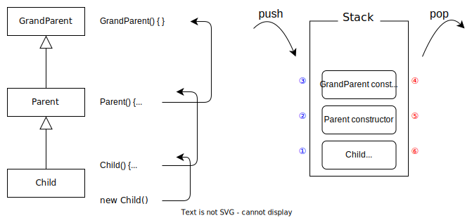
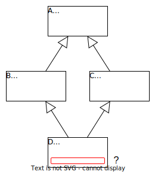

# 상속

클래스 상속의 개념 정리

**Tags**

- java
- class
- inheritance
- method overriding

**Environments**

- JDK 21

<br>

## TOC

- [클래스 상속](#클래스-상속)
- [상속되는 멤버](#상속되는-멤버)
- [상속 관계와 접근 제한자](#상속-관계와-접근-제한자)
- [메서드 오버라이딩](#메서드-오버라이딩)
  - [메서드 오버라이딩과 반환 타입](#메서드-오버라이딩과-반환-타입)
  - [@Override 어노테이션](#override-어노테이션)
  - [접근 제한 재설정](#접근-제한-재설정)
- [super 키워드](#super-키워드)
  - [필드 가려짐](#필드-가려짐)
  - [상위 타입 메서드 호출](#상위-타입-메서드-호출)
- [상위 타입 생성자](#상위-타입-생성자)
  - [super() 생성자 호출](#super-생성자-호출)
- [다중 상속](#다중-상속)
- [Object 클래스](#object-클래스)
- [final과 상속](#final과-상속)

<br>

## 클래스 상속

상속(inheritance)은 특정 클래스의 멤버를 다른 클래스가 물려받아 사용하는 것을 말한다.

- 상속을 통해 기존 클래스의 멤버 재사용 가능
- 상속을 받는 클래스에서 새로운 기능을 정의해서 기존 클래스 확장 가능
- 클래스 간 계층 구조를 나타낼 수 있음
  - 상속 계층의 위쪽은 상위 타입 아래쪽은 하위 타입이라 표현
- 슈퍼 클래스(superclass) → 다른 클래스에게 특성을 물려주는 클래스, 부모 클래스, 상위 클래스라고도 함
- 서브 클래스(subclass) → 다른 클래스의 특성을 물려받는 클래스, 자식 클래스, 하위 클래스라고도 함

클래스를 정의할 때 `extends` 키워드로 상속할 클래스를 지정한다.

```java
public class Parent { ... } // 슈퍼 클래스, Child 의 상위 타입

public class Child extends Parent { ... } // 서브 클래스, Parent 의 하위 타입
```

<br>

## 상속되는 멤버

상속 관계에서 하위 타입은 상위 타입의 멤버 중 일부를 사용할 수 있으며 하위 타입 인스턴스를 통해서도 상위 타입의 멤버를 사용할 수 있다. 상위 타입 멤버 중 하위 타입에서 사용할 수 있는 대상은 다음과 같다.

- 필드(인스턴스 변수)
- 메서드(인스턴스 메서드)
- 정적 필드
- 정적 메서드

```java
public class Parent {

    public static int parentStaticField = 20;

    public int parentField = 10;

    public static void parentStaticMethod() { ... }

    public void parentMethod() { ... }
}
```

```java
public class Child extends Parent {

    public static void childStaticMethod() {
        parentStaticMethod();   // 상위 타입의 정적 메서드 호출
        parentStaticField = 30; // 상위 타입의 정적 필드에 접근
    }

    public void childMethod() {
        parentMethod();   // 상위 타입의 메서드 호출
        parentField = 20; // 상위 타입의 필드에 접근
    }
}
```

```java
public class InheritanceMain {

    public static void main(String[] args) {
        Child child = new Child();
        child.method();         // Child 인스턴스로 상위 타입(Parent)의 메서드 호출
        child.parentField = 20; // Child 인스턴스로 상위 타입(Parent)의 필드에 접근
    }
}
```

<br>

## 상속 관계와 접근 제한자

상속 관계에 있는 클래스 간에도 접근 제한자는 유효하다. 따라서 접근 제한 설정에 따라 상속받을 수 없는 멤버도 존재한다. 하위 타입이 속한 패키지를 고려한 접근 제한 설정별 상속가능 여부는 다음과 같다.

|                   | 서브 클래스(같은 패키지) | 서브 클래스(다른 패키지) |
| ----------------- | :----------------------: | :----------------------: |
| `public`          |            O             |            O             |
| `protected`       |            O             |            O             |
| `package-private` |            O             |            X             |
| `private`         |            X             |            X             |

단 접근 제한 설정은 상위 타입 멤버에 대한 하위 타입의 직접적인 접근을 막을 뿐 상위 타입의 `public` 메서드 등을 통한 간접적인 접근은 여전히 가능하다. 또한 메모리에 할당될 때는 하위 타입 인스턴스에 상위 타입의 전용 멤버도 포함되어 할당된다.

<br>

## 메서드 오버라이딩

상위 타입에 정의된 메서드를 하위 타입에서 재정의하는 것을 메서드 오버라이딩(method overriding)이라 한다.

- 메서드 오버라이딩은 상위 타입 메서드와 같은 시그니처를 가진 메서드를 하위 타입에서 재정의하는 것
- 하위 타입 인스턴스를 통해 메서드 호출 시 오버라이딩된 메서드가 호출됨
- 메서드 오버라이딩은 인스턴스 메서드에만 적용
  - 정적 메서드와 정적 필드, 필드(인스턴스 변수)는 재정의 대상이 아니며 하위 타입에서 같은 식별자로 정의하면 상위 타입 멤버를 가림

```java
public class Parent {

    public void method() {
        System.out.println("Parent.method");
    }
}
```

```java
public class Child extends Parent {

    @Override
    public void method() {
        System.out.println("Child.method");
    }
}
```

```java
public class OverrideMain {

    public static void main(String[] args) {
        Child child = new Child();
        child.method();
    }
}
```

실행 결과

```console
Child.method
```

### 메서드 오버라이딩과 반환 타입

메서드 오버라이딩 시 반환 타입은 변경이 가능하다. 단 상위 타입 메서드가 반환하는 타입의 하위 타입으로만 변경이 가능하다.

```java
public class Parent {

    public Number getNumber() {
        return 10;
    }
}
```

```java
public class Child {

    @Override
    public Double getNumber() {
        return 10.0;
    }
}
```

`Double` 은 `Number` 의 하위 타입이므로 메서드 오버라이딩을 통해 다른 타입을 반환하는 것이 허용된다.

### @Override 어노테이션

`@Override` 어노테이션은 해당 메서드가 상위 타입의 메서드를 오버라이딩하고 있음을 나타낸다.

- `@Override` 어노테이션을 붙이면 오버라이딩하는 메서드가 상위 타입에 존재하는지 컴파일러 수준에서 확인
- `@Override` 어노테이션은 선택사항이나 붙이는 것이 권장사항

```java
public class Parent {

    public void method(int a, int b) { ... }
}
```

```java
public class Child extends Parent {

    @Override
    public void method(int a, int b) { ... }

    @Override                    // 컴파일 에러
    public void method() { ... } // 상위 타입 메서드에 없는 메서드(매개변수 수가 다름)

    @Override                                      // 컴파일 에러
    public void method(double a, double b) { ... } // 상위 타입에 없는 메서드(매개변수 타입이 다름)

    @Override                           // 컴파일 에러
    public void methodAnother() { ... } // 상위 타입에 없는 메서드(이름이 다름)
}
```

### 접근 제한 재설정

메서드 오버라이딩 시 접근 제한자를 변경할 수 있다. 단 상위 타입 메서드보다 더 강한 접근 제한을 설정할 수는 없다. 예를 들어 `protected` 메서드를 `public` 으로 오버라이딩할 수는 있지만 `private` 로 오버라이딩하는 것은 불가능하다.

```java
public class Parent {

    protected void method() { ... }
}
```

```java
public class Child1 extends Parent {

    @Override
    public void method() { ... } // protected -> public, 더 느슨한 접근 제한 O
}
```

```java
public class Child2 extends Parent {

    @Override                     // 컴파일 에러
    private void method() { ... } // protected -> private, 더 강한 접근 제한 X
}
```

<br>

## super 키워드

`super` 키워드는 상위 타입에 대한 참조를 나타낸다. 따라서 인스턴스에서 명시적으로 상위 타입 멤버에 접근하고자 할 때 사용할 수 있다. 단 `super` 는 자기자신에 대한 참조를 상위 타입으로 취급할 뿐 인스턴스 내에서 아예 다른 인스턴스를 참조하는 것은 아니다. 또한 여러 단계의 상속 계층에서 멤버 간 식별자가 겹친다면 `super` 로 선택되는 대상은 가장 가까운 상위 타입의 멤버가 된다.

### 필드 가려짐

하위 타입에서 상위 타입과 같은 식별자의 필드를 만들면 상위 타입의 필드가 가리게 된다. 이 때 `super` 로 상위 타입 필드에 접근할 수 있다. 물론 애초에 하위 타입에서 상위 타입 필드를 가리지 않게끔 하는 것이 옳다.

```java
public class Parent {

    protected String instanceField = "parent field";
}
```

```java
public class Child extends Parent {

    private String instanceField = "child field";

    public void printFields() {
        System.out.println(instanceField);       // 자신의 필드에 접근
        System.out.println(super.instanceField); // 상위 타입의 필드에 접근
    }
}
```

```java
public class SuperKeywordMain {

    public static void main(String[] args) {
        Child child = new Child();
        child.printFields();
    }
}
```

실행 결과

```console
child field
parent field
```

> 정적 멤버와 가려짐 현상
>
> 정적 멤버도 필드와 마찬가지로 하위 타입에서 같은 식별자의 정적 멤버를 만들면 상위 타입 멤버를 가리게 된다. 또한 정적 멤버는 인스턴스에 묶이는 멤버가 아니므로 `super` 로는 접근할 수 없다. 따라서 정적 멤버가 상위 타입과 겹치는 경우 클래스를 통해 접근해야 한다. 단 필드와 마찬가지로 애초에 상위 타입과 겹치게 만들어서 가리는 상황 자체를 피하는 것이 바람직하다.
>
> 참고로 인스턴스를 통해 정적 멤버에 접근하면 해당 인스턴스의 참조값을 가지고 있는 변수의 타입에 영향을 받으며 해당 변수의 타입에 선언된 정적 멤버가 우선시된다. 물론 애시당초 정적 멤버는 클래스를 통해 접근하는 것이 바람직하다.

### 상위 타입 메서드 호출

하위 타입에서 오버라이딩한 메서드에 대해 상위 타입의 메서드로 호출하려면 `super` 를 사용하면 된다. 이 경우 상위 타입에서 정의한 메서드가 호출된다.

```java
public class Parent {

    public void method() {
        System.out.println("Parent.method");
    }
}
```

```java
public class Child extends Parent {

    public void call() {
        method();       // Child 의 method() 호출
        super.method(); // Parent 의 method() 호출
    }

    @Override
    public void method() {
        System.out.println("Child.method");
    }
}
```

```java
public class SuperKeywordMain {

    public static void main(String[] args) {
        Child child = new Child();
        child.call();
    }
}
```

실행 결과

```console
Child.method
Parent.method
```

<br>

## 상위 타입 생성자

상속 관계에 있는 클래스의 인스턴스를 생성하면 상위 타입의 생성자를 재귀적으로 호출하여 각 타입의 초기화 작업을 처리한다.



- 하위 타입 인스턴스 생성 시 하위 타입의 생성자가 호출되며 생성자 내부에서 상위 타입의 생성자를 호출
  - 이 과정을 더 이상 상위 타입이 없을때까지 재귀적으로 반복하므로 결과적으로 최상위 타입의 생성자까지 호출
- 스택에 하위 타입 생성자가 먼저 push 되므로 상위 타입 생성자가 먼저 처리됨

### super() 생성자 호출

`super()` 는 상위 타입의 생성자를 호출한다. 다른 클래스의 상속을 받는 모든 클래스는 생성자에서 `super()` 로 상위 타입의 생성자를 호출해야 하며 호출하지 않을 경우 컴파일 에러가 발생한다.

- `super()` 는 상위 타입의 기본 생성자를 호출함
- `super()` 가 생성자에 없는 경우 컴파일러가 대신 넣어줌
  - 단 상위 타입에 기본 생성자가 없는 경우 명시적으로 상위 타입 생성자를 호출해야 함, 호출하지 않으면 컴파일 에러
- `super()` 는 생성자 첫번째 줄에 와야함
- 생성자 내에서 `this()` 로 다른 생성자를 호출하는 경우에도 최종적으로 `super()` 는 호출되어야 함

```java
public class GrandParent {

    public GrandParent() {
        System.out.println("grand parent constructor");
    }
}
```

```java
public class Parent extends GrandParent {

    public Parent(int num) {
        super(); // 생략 가능(GrandParent 에 기본 생성자가 있으므로 컴파일러 수준에서 대신 넣어줄 수 있음)
        System.out.println("parent constructor");
    }
}
```

```java
public class Child extends Parent {

    public Child() {
        super(10); // Parent 의 생성자를 명시적으로 호출 (Parent 에 기본 생성자가 없음)
        System.out.println("child constructor");
    }
}
```

```java
public class SuperConstructorMain {

    public static void main(String[] args) {
        new Child();
    }
}
```

실행 결과

```console
grand parent constructor
parent constructor
child constructor
```

<br>

## 다중 상속

자바는 클래스의 다중 상속을 허용하지 않는다.



`A` 클래스를 `B`, `C` 가 각각 상속하고 `method()` 를 오버라이딩했다고 하면 `B`, `C` 의 상속을 받는 `D` 로 `method()` 를 호출하면 어떤 클래스의 메서드를 호출해야 하는가? 이를 죽음의 다이아몬드라고 하며 다중 상속으로 인해 발생하는 문제다. 더불어 다중 상속은 과도하게 복잡한 클래스 계층 구조를 만들 수도 있다. 따라서 자바는 이러한 문제점 때문에 다중 상속을 허용하지 않는다.

<br>

## Object 클래스

자바의 모든 클래스는 직/간접적으로 `Object` 클래스의 상속을 받는다. `Object` 클래스에는 모든 객체에 필요한 몇가지 인스턴스 메서드가 정의되어 있으며 필요한 경우 하위 타입에서 오버라이딩해서 사용하게 된다.

- 상위 타입이 명시되지 않은 클래스는 모두 `Object` 를 상속받도록 컴파일러 수준에서 처리
- 상위 타입이 명시된 경우에도 상위 타입이 `Object` 의 하위 타입일 것이므로 결과적으로 자바의 모든 클래스는 `Object` 의 하위 타입

<br>

## final과 상속

`final` 키워드를 사용하면 상속 불가능한 클래스, 오버라이딩 불가능한 메서드를 만들 수 있다.

```java
public final class A { ... } // 상속 불가능한 클래스

public final void method() { ... } // 하위 타입에서 오버라이딩 불가능한 메서드
```

```java
public final class ImmutableClass { ... }

public class MutableClass extends ImmutableClass { ... } // 컴파일 에러, final 클래스 상속을 시도
```

```java
public class Parent {

    public final void method() { ... } // 오버라이딩 불가능한 메서드
}
```

```java
public class Child extends Parent {

    @Override
    public final void method() { ... } // 컴파일 에러, final 메서드 오버라이딩 시도
}
```

`final` 로 상속, 오버라이딩을 불가능하게 만드는 이유

- 불변 클래스 등을 만들기 위해서 사용 (예 `String` 클래스)
- 메서드 구현을 변경하면 안되는 경우에 사용 (예 `Object` 의 일부 메서드)

<br>

## References

- [Inheritance - Dev.java](https://dev.java/learn/inheritance/what-is-inheritance/)
- [Overriding and Hiding Methods - Dev.java](https://dev.java/learn/inheritance/overriding/)
- [Java® Platform, Standard Edition & Java Development Kit Version 21 API Specification #Annotation Interface Override](https://docs.oracle.com/en/java/javase/21/docs/api/java.base/java/lang/Override.html)
- [Polymorphism #Writing Final Classes and Methods - Dev.java](https://dev.java/learn/inheritance/polymorphism/#final-classes-methods)
- [Java Language Specification se21 #ch8.4.8](https://docs.oracle.com/javase/specs/jls/se21/html/jls-8.html#jls-8.4.8)
- [Java Language Specification se21 #ch15.11.2](https://docs.oracle.com/javase/specs/jls/se21/html/jls-15.html#jls-15.11.2)
- [김영한의 실전 자바 - 기본편 - 김영한, Inflearn](https://www.inflearn.com/course/%EA%B9%80%EC%98%81%ED%95%9C%EC%9D%98-%EC%8B%A4%EC%A0%84-%EC%9E%90%EB%B0%94-%EA%B8%B0%EB%B3%B8%ED%8E%B8)
