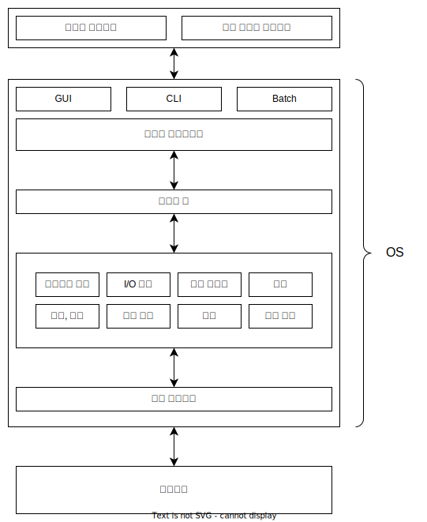

# OS의 구성

OS를 큰 개념으로 바라보면 핵심이 되는 커널과 시스템 프로그램 그리고 응용 프로그램으로 구성되며 OS가 제공하는 서비스를 커널이 제공하는 방식에 따라 몇 가지 구성 방식이 있다.

## 서비스 관점에서의 OS

OS는 자원 할당자, 제어 프로그램 등의 역할을 하는데 제공하는 서비스를 컴퓨터 시스템 구성 요소와 함께 보면 다음과 같다.

| 구성요소          | 설명                                                                                                          |
| ----------------- | ------------------------------------------------------------------------------------------------------------- |
| 사용자 인터페이스 | GUI, CLI, Batch 등의 방식으로 사용자가 컴퓨터 시스템에 명령을 내리기 위한 환경을 제공한다.                    |
| 시스템 콜         | OS가 제공하는 서비스에 대한 인터페이스로 OS가 제공하는 서비스를 안전하게 사용하기 위한 인터페이스를 제공한다. |
| 프로그램 실행     | 프로그램을 메모리에 적재하여 실행할 수 있는 환경을 제공한다.                                                  |
| I/O 연산          | I/O 장치 등을 활용하는 I/O 연산의 처리 수단을 제공한다.                                                       |
| 파일 시스템       | 파일 조작이 필요한 프로그램에 파일 생성, 삭제, 검색, 권한 처리 등의 파일 관련 기능을 제공한다.                |
| 통신              | 같은 컴퓨터 또는 네트워크 상의 연결된 컴퓨터에서 여러 프로세스 간 정보를 교환할 수 있는 환경을 제공한다.      |
| 보호, 보안        | 다중 사용자 또는 네트워크 환경에서 정보의 사용을 통제한다. 프로세스가 OS 자체를 방해하지 않도록 한다.         |
| 오류 탐지         | 하드웨어 오류, 프로그램 오류 등에 대한 적절한 조치를 취한다.                                                  |
| 로깅              | 시스템 자원의 사용량을 기록, 관리한다.                                                                        |
| 자원 할당         | 다수의 프로세스나 작업이 동시에 실행될 때 문제가 생기지 않도록 자원을 적절하게 할당한다.                      |
| 장치 드라이버     | 하드웨어 장치와 OS간의 소통을 위한 인터페이스를 제공한다.                                                     |

## OS 구성 방식

OS의 구성 방식의 핵심은 커널을 어떤식으로 구성하는가에 달려있다.

### 모놀리식

가장 단순한 구조로 커널의 모든 기능을 하나의 이진 파일에 구성한다. 커널은 세부적으로 여러 인터페이스와 장치 드라이버로 분리된다.

시스템 콜 그리고 하드웨어 인터페이스 사이의 모든것이 커널에 결합되어 커널 내에 모든 기능이 있으므로 시스템 콜에 대한 오버헤드가 없고 커널 내의 통신 속도가 빠르다. 대신 확장이 어렵다.

### 레이어드

OS를 사용자부터 가장 밑의 하드웨어까지 여러 층으로 나누어 구성하는 방식이다.

각 층은 자신의 하위층의 서비스와 기능만 사용하도록 구성한다. 특정 계층의 기능이 올바르게 구현되었다면 해당 계층을 사용하는 계층에서는 자신의 계층만 생각하면 되므로 오류 발견이 쉽다. 대신 사용자 계층에서 하드웨어 계층까지 여러 계층을 통과해야 하므로 오버헤드가 발생한다.

### 마이크로 커널

일부 중요한 구성요소를 제외하고 모두 커널에서 분리하는 방식이다. (커널에서 분리하는 기준이 명확한 것은 아니다.)

마이크로 커널 방식에서 커널의 주 역할은 클라이언트 프로그램과 OS의 서비스를 제공하는 프로그램 간의 통신을 제공하는 것이다.(OS의 서비스를 제공하는 프로그램은 사용자 프로세스로 수행된다.) 클라이언트 프로그램은 커널을 통해 서비스와 간접적으로 상호작용 한다.

각 서비스가 별도의 프로세스로 돌아가기 때문에 하나의 서비스에 문제가 생겨도 다른 서비스에는 영향이 가지 않으며 보안성과 신뢰성이 좋다. 대신 서비스를 제공받기 위해 커널을 통해 간접적으로 메시지를 주고 받아야 하므로 오버헤드가 발생한다.

### 모듈

커널이 핵심 구성요소를 가지며 부팅 또는 실행 중 서비스를 모듈을 통해 사용하는 방식이다.

커널에 모든 기능이 추가된 것이 아니라 동적으로 커널과 서비스를 제공하는 모듈을 연결하기 때문에 새로운 기능의 추가가 쉽다. 다른 기능을 모듈의 형태로 추가해도 기존 커널을 재컴파일할 필요가 없다. 또한 통신하기 위해 메시지를 전달하는 필요가 없으며 각 모듈이 보호된 인터페이스를 가진다는 점이 장점이다.

### 하이브리드

다양한 구조를 결합하여 사용하는 형태로 각 구성 방식의 장점을 더해서 성능, 보안, 편의성 문제를 해결하는 방식이다. 대부분의 OS는 한 가지 방식으로 만든어진 것이 아닌 하이브리드 방식의 구조를 선택한다.

## Reference

- Operating System Concepts 10th Edition
