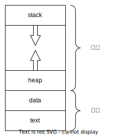
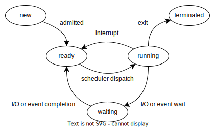
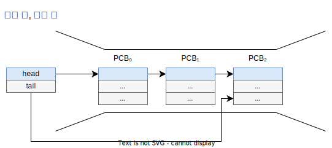
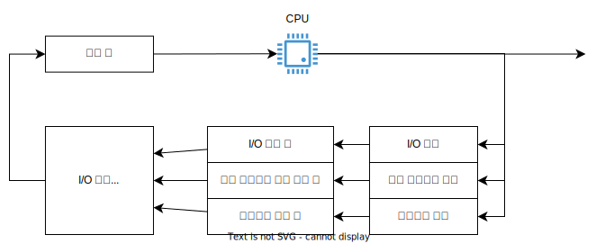
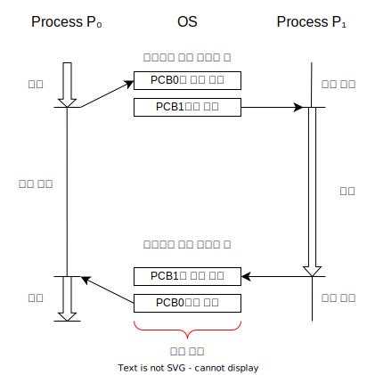

# 프로세스

[전체 소스코드](../../til-code/os/process/)

프로세스는 실행 중인 프로그램을 말한다. 프로그램은 명령어 리스트를 가지는 파일이 디스크에 저장된 것을 말하며 이러한 프로그램이 메모리에 적재되어 CPU가 실행할 수 있는 상태가 바로 프로세스다.

보통 다수의 프로세스가 메모리에 올라가서 번갈아가며 실행된다. 이는 CPU 자원을 최대한 활용하기 위함이며 코어가 여러개인 경우 각 프로세스는 병렬로 실행될 수 있다.

## 프로세스 메모리

프로세스는 메모리를 여러 섹션으로 나누어 관리한다. 다음은 프로그램이 프로세스로 메모리에 적재될 때의 메모리 레이아웃이다.



- stack - 함수 호출시 임시 데이터를 저장하는 용도로 쓰이며 프로그램 실행 중 동적으로 사이즈가 변할 수 있다.
- heap - 프로그램 실행 중 동적으로 할당되는 메모리 영역으로 프로그램 실행 중 동적으로 사이즈가 변할 수 있다.
- data - 전역 변수를 저장한다. 크기는 고정이다.
- text - 실행할 코드가 저장된다. 크기는 고정이다.

> 자바와 프로세스
>
> 프로세스 자체가 다른 대상을 실행하는 환경으로 동작할 수 있는데 자바가 대표적인 예이다. 자바 프로그램은 JVM 내에서 실행되는데 *java* 명령은 JVM 프로세스를 실행하고 JVM은 자바 프로그램(바이트코드)을 실행한다.

## 프로세스 상태

하나의 코어는 하나의 프로세스만 실행할 수 있다. 따라서 항상 모든 프로세스가 실행 상태인 것은 아니며 대기 상태, 준비 상태 등일 수 있다. 일반적인 프로세스의 상태는 다음과 같이 변화하며 OS마다 약간씩 다를 수 있다.



- **new** - 프로세스가 생성 중인 상태
- **running** - 프로세스의 명령어들이 실행중인 상태
- **ready** - 프로세스가 프로세서에 할당되기를 기다리는 상태
- **waiting** - 프로세스가 특정 이벤트(I/O 완료 등)을 기다리는 상태
- **terminated** - 프로세스의 실행이 종료된 상태

## PCB

PCB는 Process Control Block의 약자로 특정 프로세스와 관련된 정보를 저장하고 있다. 이 정보는 프로세스를 실행할 때 필요한 모든 데이터이며 PCB는 이러한 데이터를 저장하는 저장소의 역할을 한다. 저장하는 정보는 다음과 같다.

| 이름                | 설명                                                                                         |
| ------------------- | -------------------------------------------------------------------------------------------- |
| 프로세스 상태       | 현재 프로세스의 상태, new, ready, running, waiting 등                                        |
| 프로그램 카운터(PC) | 해당 프로세스의 다음 실행할 명령어의 주소를 가리킨다.                                        |
| CPU 레지스터 정보   | 프로세스가 스케줄러에 의해 다시 실행될 때 올바른 실행을 위해 CPU 레지스터의 정보를 저장한다. |
| CPU 스케줄링 정보   | 프로세스의 우선순위, 스케줄링 큐의 포인터, 스케줄링 관련 매개변수를 포함한다.                |
| 메모리 관리 정보    | OS가 사용하는 메모리 시스템에 따라 메모리 정보가 포함된다.                                   |
| 회계 정보           | CPU 사용 시간, 프로세스 번호 등                                                              |
| I/O 상태 정보       | 프로세스에 할당된 I/O 장치와 열린 파일 목록 등을 포함한다.                                   |

## 프로세스 스케줄링

OS는 CPU 자원을 최대한 활용하기 위해 다수의 프로세스를 실행한다. 이 때 시분할 방식으로 매우 빠르게 프로세스를 번갈아 실행하여 사용자 입장에서는 동시에 실행되는 것처럼 보이게 한다.(코어가 여러개인 경우 실제로 동시에 처리된다.)

CPU가 여러 프로세스를 번갈아가며 실행하기 위해 필요한 것이 프로세스 스케줄러로 여러 프로세스 중 실행할 하나를 선택한다. 실행될 프로세스를 선택할 때는 프로세스의 특징을 고려해야 하며 프로세스는 수행하는 작업의 특징에 따라 두가지로 분류할 수 있다.

- I/O 바운드 프로세스 - 연산보다 I/O에 더 많은 시간을 소비하는 프로세스
- CPU 바운드 프로세스 - 연산에 보다 많은 시간을 소비하며 I/O가 자주 발생하지 않는 프로세스

### 스케줄링 큐

프로세스가 ready 상태가 되면 준비 큐에 들어가서 스케줄러에 의해 선택되기를 기다린다. 스케줄러에 의해 선택되면 CPU에서 실행되고 running 상태가 된다.

running 상태에서 인터럽트 혹은 I/O 완료나 특정 이벤트를 기다려야 하면 waiting 상태로 변하며 대기 큐에 들어간다.

준비 큐, 대기 큐는 일반적으로 연결리스트로 구현되며 리스트의 요소로 PCB를 저장한다. 다음은 준비 큐 또는 대기 큐의 형태를 보여준다.



프로세스는 ready → running → waiting → ready 상태를 프로세스가 완전히 종료될 때 까지 반복한다. 즉 준비 큐와 대기 큐를 계속해서 오가게 된다. 프로세스가 완전히 종료되면 프로세스 관련 모든 자원과 PCB가 OS에 반환된다.



### CPU 스케줄링

CPU 스케줄러는 준비 큐에 있는 프로세스 중 하나를 선태갷서 CPU 코어에 할당해서 실행되도록 한다. 특정 프로세스에 너무 오랜시간 CPU 코어를 할당할 수 없으므로 CPU 스케줄링은 매우 빈번하게 발생한다.

### Context Switch

특정 프로세스를 실행하다가 중단하고 다른 프로세스를 실행할 때는 이전 프로세스의 실행에 대한 정보를 저장하고 새롭게 실행할 프로세스의 정보를 복구하는 작업이 필요하다. 이것을 문맥 교환(Context Switch)이라고 한다. 문맥 교환은 순수한 오버헤드로 너무 빈번하게 발생하면 성능에 영향을 준다.

프로세스 P₀, P₁가 있다고 할 때 두 프로세스는 다음처럼 실행될 것이다.



1. P₀의 실행 중 인터럽트, 시스템 콜 등이 발생하면 실행을 멈추고 PCB에 현재 상태를 저장한다.  
   P₀는 running → waiting 또는 ready 상태
2. P₁의 상태를 PCB에서 복구해서 실행한다.  
   P₁는 ready → running 상태
3. P₁의 실행 중 인터럽트, 시스템 콜 등이 발생하면 실행을 멈추고 PCB에 현재 상태를 저장한다.  
   P₁는 running → waiting 또는 ready 상태
4. P₀의 상태를 PCB에서 복구해서 실행한다.  
   P₀는 ready → running 상태

## 프로세스 연산

OS는 프로세스의 생성과 종료를 위한 기법을 제공하며 OS별로 차이가 있다. 아래 예제는 모두 mac OS 환경에서 C언어 기준으로 작성되었다.

### 프로세스 생성

프로세스는 실행 중 여러 다른 프로세스를 생성할 수 있다. 생성하는 프로세스를 부모 프로세스 생성되는 프로세스를 자식 프로세스라 하며 트리 구조를 형성한다.

대부분의 OS는 pid라는 프로세스 식별자를 사용해서 프로세스를 구분하며 일반적으로 정수값을 사용한다. 

> unix, linux 시스템의 프로세스 트리
>
> unix, linux는 시스템 부팅시 생성되는 특정 프로세스가 여러 프로세스를 생성한다. linux의 경우 systemd 프로세스가 이 역할을 하며 mac의 경우 launchd 프로세스가 이 역할을 한다.

프로세스에서 다른 프로세스를 생성할 때 두가지 방법으로 실행할 수 있다.

- 부모 프로세스와 자식 프로세스가 병행으로 실행된다.
- 부모 프로세스는 자식 프로세스의 실행이 완료되기를 기다린다.

프로세스의 메모리 사용을 기준으로 보면 두가지 방식으로 구분할 수 있다.

- 자식 프로세스는 부모 프로세스의 복사본으로 똑같은 프로그램, 데이터를 가진다.
- 자식 프로세스가 자신에게 적재될 별도의 프로그램을 가진다.

#### `fork()` 시스템 콜

`fork()` 는 unix 시스템에서 제공되는 새로운 프로세스를 생성하는 시스템 콜이다.(POSIX 표준) 새로운 프로세스는 부모 프로세스의 복사본으로 생성이된다. 

```c
#include <sys/types.h>
#include <unistd.h>

int main(int argc, const char *argv[]) {
    pid_t pid = fork();

    if (pid == 0) {
        printf("자식 프로세스 작업\n");
    } else if (pid > 0) {
        printf("부모 프로세스 작업\n");
    } else  {
        fprintf(stderr, "fork 실패");
    }
    return 0;
}
```

`fork()` 는 unistd.h 헤더에 정의되어 있으며 반환되는 프로세스 식별자는 `pid_t` 타입으로 sys/types.h 헤더에 정의되어 있다.

`fork()` 시스템 콜은 부모 프로세스의 복사본이므로 같은 프로그램을 실행하게 된다. 따라서 pid 값을 구분해서 부모 프로세스와 자식 프로세스의 작업을 나눌 수 있다.

`fork()` 가 반환하는 pid는 현재 프로세스에 따라 다르다. 생성된 자식 프로세스 기준에서는 0이 되며 부모 프로세스 기준에서는 0 이외의 값(자식 프로세스의 pid값)이 된다. 만약 프로세스 생성에 문제가 생긴경우 pid는 음수가 된다.

#### `getpid()`, `getppid()` 시스템 콜

`getpid()` 시스템 콜을 사용하면 현재 실행에서의 pid를 얻을 수 있다.

```c
printf("%d", getpid());
```

`getpid()` 를 사용해보면 부모 프로세스 기준 `fork()` 의 반환값이 자식 프로세스의 pid라는 것을 알 수 있다.

```c
pid_t pid = fork();

if (pid == 0) {
    printf("자식 프로세스의 pid: %d\n", getpid());
} else if (pid > 0) {
    printf("부모 프로세스가 생성한 자식 프로세스 pid: %d\n", pid);
}
```

`getppid()` 시스템 콜을 사용하면 해당 프로세스 기준 부모 프로세스의 pid를 얻을 수 있다.

```c
if (pid == 0) {
    printf("자식 프로세스의 부모 프로세스 pid: %d\n", getppid());
} else if (pid > 0) {
    printf("부모 프로세스의 부포 프로세스 pid: %d\n", getppid());
}
```

자식 프로세스에서 `getppid()` 는 `fork()` 를 호출한 부모 프로세스의 pid가 반환된다. 부모 프로세스 또한 부모 프로세스를 가지는데 여기서 부모 프로세스는 해당 프로그램을 실행한 프로세스가 된다. 따라서 일반적으로 터미널이나 xcode 등에서 실행하면 해당 프로세스의 pid가 찍히게 된다.

#### exec 계열 함수

exec 계열 함수들은 현재 프로세스의 이미지를 새 이미지로 변경한다. 즉 프로세스가 실행할 프로그램을 바꾼다. 프로세스의 새 이미지는 일반 실행 파일로 구성된다.

`execlp()` 는 exec 계열 함수 중 하나이며 크게 3가지의 매개변수를 받는다.

- 실행할 프로그램 파일 경로
- 프로그램 실행 시 넘겨줄 인자 목록(가변인자)
- 가변인자 끝을 알리는 `NULL` 값

단순하게 실행 시 인자로 받은 값을 콘솔에 출력하는 프로그램 print 를 다음과 같이 작성하자.

```c
// print.c
#include <stdio.h>

int main(int argc, const char *argv[]) {
    for (int i = 0; i < argc; i++) {
        printf("%s\n", argv[i]);
    }
    return 0;
}
```

실행할 수 있도록 다음 명령어로 컴파일한다. 결과 실행 파일은 print 라는 이름을 가진다.

```zsh
clang print.c -o print
```

이제 이 프로그램을 `execlp()` 를 통해 새로운 프로세스에게 실행하도록 만드는 프로그램을 작성하면 다음과 같다. `execlp()` 의 인자에 주의하자.

```c
pid_t pid = fork();
    
if (pid == 0) {
    execlp("./print", "print", "자식 프로세스의 작업", NULL);
} 
```

`execlp()` 함수는 성공적으로 실행되면 제어를 반환하지 않는데 이는 메모리를 새 프로그램으로 덮어썻기 때문이면 실패할 경우 -1을 반환한다.

### 프로세스 종료

프로세스가 모든 실행문을 다 처리하고 `exit()` 함수를 사용해 OS에 삭제를 요청하면 종료된다. (c 언어에서 `exit()` 함수를 명시적으로 쓰지 않아도 main 함수를 return 문으로 빠져나오면 종료된다.)

이 때 부모 프로세스는 `wait()` 시스템 콜을 통해 자식 프로세스의 실행 완료를 기다리며 자식 프로세스가 완료되면 해당 자원을 반환한다. 

```c
#include <stdio.h>
#include <stdlib.h>
#include <sys/types.h>
#include <sys/wait.h>
#include <unistd.h>

int main(int argc, const char * argv[]) {
    pid_t pid = fork();
    int status;
    
    if (pid == 0) {
        printf("자식 프로세스 pid: %d\n", getpid());
        sleep(1);
    } else if (pid > 0) {
        pid_t terminated = wait(&status);
        printf("종료된 프로세스 pid: %d\n", terminated);
    } else {
        fprintf(stderr, "fork 실패");
    }
    
    return 0;
}
```

`wait()` 시스템 콜은 sys/wait.h 헤더에 정의되어 있으므로 해당 헤더를 추가한다. 

`wait()` 시스템 콜을 호출하면 부모 프로세스는 자식 프로세스의 종료를 기다리게 되고 자식 프로세스가 종료되면 인자로 넘겨준 정수형 변수에 상태 정보를 받으며 `wait()` 의 반환값으로 종료된 자식 프로세스의 pid를 받는다.

#### 좀비 프로세스, 고아 프로세스

프로세스를 종료하면 OS에서 사용한 자원을 가져가지만 프로세스의 종료 상태를 저장하는 프로세스 테이블의 항목은 남아있게 된다. 이 값은 부모 프로세스가 `wait()` 시스템 콜을 호출할 때 까지 남게되며 프로세스 자체는 종료되었지만 부모 프로세스가 아직 `wait()` 시스템 콜을 호출하지 않은 프로세스를 좀비 프로세스라 한다. 부모 프로세스에서 `wait()` 시스템 콜을 호출하면 프로세스의 식별자와 테이블의 해당 항목이 OS에 반환된다.

만약 부모 프로세스가 `wait()` 시스템 콜을 호출하지 않고 그대로 종료해버린 경우 자식 프로세스는 고아 프로세스가 된다. 이 경우 자식 프로세스의 종료 시 종료 상태 정보가 제거되지 않는데 이 문제 해결을 위해 unix 등은 다른 프로세스를 고아 프로세스의 부모 프로세스로 지정하고 `wait()` 를 주기적으로 호출하여 고아 프로세스의 종료 상태 수집 및 프로세스 식별자와 테이블 항목을 반환한다.

mac의 경우 고아 프로세스를 launchd 프로세스의 자식 프로세스로 만들어서 이 문제를 처리한다.

```c
pid_t pid = fork();
    
if (pid == 0) {
    for (int i = 0; i < 3; i++) {
        printf("현재 프로세스의 부모 프로세스 pid: %d\n", getppid());
        sleep(1);
    }
} else if (pid > 0) {
    sleep(1);
} 
```

출력은 다음과 같다.

```console
현재 프로세스의 부모 프로세스 pid: 85871
현재 프로세스의 부모 프로세스 pid: 85871
현재 프로세스의 부모 프로세스 pid: 1
```

자식 프로세스는 3초후 종료되며 부모 프로세스는 1초후 종료된다. `wait()` 시스템 콜을 호출하지 않기 때문에 자식 프로세스는 고아 프로세스가 되는데 부모 프로세스 종료전에는 부모 프로세스의 pid가 찍히지만 종료후에는 launchd 프로세스의 pid인 1이 찍힌다. 요점은 OS에서 고아 프로세스를 처리하기 위해 다른 프로세스를 고아 프로세스의 부모 프로세스로 지정한다는 것이다.

## Reference

- Operating System Concepts 10th Edition
