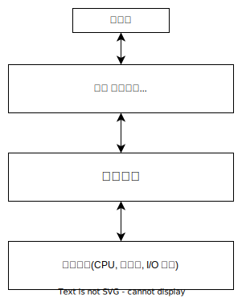

# OS의 역할

OS는 컴퓨터 시스템의 큰 구성요소중 하나로 개념적으로 응용 프로그램과 하드웨어 사이에 위치한다.

사용자는 응용 프로그램을 통해 컴퓨터 시스템을 활용한다. 이러한 응용 프로그램은 CPU, 메모리, I/O 장치 등 하드웨어 자원을 사용하게 되는데 이러한 하드웨어 자원을 관리하며 프로그램이 작업할 수 있는 환경을 제공하는 것이 OS의 역할이다.

## 자원 할당자

대표적인 하드웨어 자원은 다음과 같다.

- CPU 시간
- 메모리 공간
- 저장장치 공간
- I/O 장치

OS는 이러한 자원의 관리자 역할을 하며 프로그램들이 수행되며 하드웨어 자원을 요청할 때 서로 상충하지 않고 효율적으로 동작하도록 처리한다.

## 제어 프로그램

OS는 컴퓨터 프로그램의 부적절한 사용 방지를 위해 사용자 프로그램을 제어하며 I/O 장치의 제어와 작동에 관여한다.

## Reference

- Operating System Concepts 10th Edition
