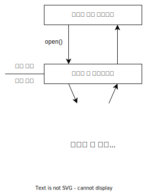

# 시스템 콜

시스템 콜은 OS가 제공하는 서비스에 대한 인터페이스다. 하드웨어 접근과 같은 저수준 작업은 어셈블리 등을 사용해 작성되어도 이런 서비스를 호출하는 것은 C, C++로 작성된 함수 형태로 제공되며 모든 OS는 고유의 시스템 콜 이름을 가진다.

## 시스템 콜 유형

시스템 콜은 몇가지 중요한 유형으로 구분할 수 있으며 제공하는 기능은 다음과 같다.

| 유형           | 제공하는 기능                                                  |
| -------------- | -------------------------------------------------------------- |
| 프로세스 제어  | 프로세스의 생성, 속성 정보의 획득 및 설정, 대기, 동기화 등     |
| 파일 조작      | 파일의 생성, 삭제, 읽기, 쓰기, 이동, 파일 속성 획득 및 설정 등 |
| 장치 조작      | 하드웨어 장치 요청, 방출 등                                    |
| 정보 유지 보수 | 시간 정보 획득, 시스템 관련 정보 획득, 프로세스 정보 획득 등   |
| 통신           | 프로세스 간 통신을 위한 정보 획득, 연결의 생성과 삭제 등       |
| 보호           | 자원의 보호를 위한 권한 정보 획득 및 설정                      |

## API

단순한 기능도 실제로 구현하려면 수많은 시스템 콜을 호출해야 한다. 따라서 대부분의 개발자는 직접 수천개의 시스템 콜을 호출하는 것이 아니라 API를 통해 간접적으로 시스템 콜을 호출하게 된다. 개발자는 API를 사용하고 API는 내부적으로 시스템 콜을 호출한다. API에는 Windows API, POSIX API, Java API 등이 있다.(API를 구성하는 일부 함수들은 실제 시스템 콜과 유사함)

API를 사용했을 떄의 장점은 다음과 같다.

- 직접 시스템 콜을 호출하는 것에 비해 쉽다.
- 특정 API를 지원하는 시스템에서는 호환성을 보장할 수 있다.(완벽하지는 않음)

## 시스템 콜과 런타임 환경

런타임 환경은 특정 프로그래밍 언어로 작성된 프로그램을 실행하는데 필요한 환경과 소프트웨어를 가리키는 말이다. 런타임 환경은 시스템 콜의 처리에 중요한 역할을 한다.

런타임 환경은 시스템 콜 인터페이스를 제공하며 API 함수를 호출하면 호출을 가로채서 시스템 콜 인터페이스가 적절한 OS의 시스템 콜을 호춯한다. 시스템 콜 인터페이스는 적절한 시스템 콜을 호출한 뒤 처리된 결과를 돌려주게 된다. 덕분에 API를 호출하는 개발자는 시스템 콜의 구현과 실행 중의 작업을 몰라도 되며 세부적인 구현내용은 런타임 환경이 관리하게 된다.

예를 들어 `open()` 이라는 API를 호출하여 시스템 콜 인터페이스를 통해 동작하는 과정은 다음과 같다.

1. 응용 프로그램에서 OS의 서비스를 사용하기 위해 `open()` API를 호출한다.
2. `open()` API의 호출을 시스템 콜 인터페이스가 가로채서 적절한 시스템 콜을 호출한다. (이 때 커널 모드로 전환됨)
3. 적절한 시스템 콜이 모두 호출된뒤 결과를 호출자에게 반환한다.(이 때 유저 모드로 다시 전환됨)
4. 응용 프로그램은 결과를 받아 작업을 처리한다.

## 시스템 서비스

시스템 유틸리티 라고도 하며 프로그램 개발, 실행 등을 위한 편리한 환경을 제공한다. 단순하게 시스템 콜에 대한 인터페이스 정도일 수도 있고 훨씬 복잡하게 구현될 수도 있다.

시스템 유틸리티를 몇 가지로 분류하면 다음과 같다.

- 파일 관리 - 파일 관련 기능을 제공한다.
- 상태 정보 - 날짜, 시간, 메모리, 디스크 용량 등의 상태 정보를 제공한다.
- 파일 변경 - 디스크 등에 저장된 파일의 내용을 조작한다.
- 프로그래밍언어지원 - 컴파일러, 어셈블러, 디버거, 인터프리터 등이 이에 해당한다.
- 프로그램 적재, 수행 - 프로그램 실행을 위해 메모리에 적재하는 로더 등
- 통신 - 프로세스 간 또는 사용자 간의 가상 접속을 이루기 위한 기법을 제공한다.
- 백그라운드 서비스 - 시스템이 종료될때 까지 유지되는 프로그램

## Reference

- Operating System Concepts 10th Edition
