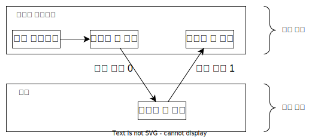

# 유저 모드, 커널 모드

OS는 컴퓨터 시스템의 안전한 사용을 위해서 OS 코드와 사용자 정의 코드를 구분해야 한다. 이를 위해 OS는 프로세스가 실행될 때의 실행 모드를 두 종류로 나누어 처리한다.

- 유저 모드 - 사용자 프로그램이 실행되는 모드
- 커널 모드 - 커널이 실행되는 모드

## 모드 비트

실행 모드를 구분하기 위해서 하드웨어의 특정 비트를 모드 비트로 사용한다. 커널 모드는 비트 0, 유저 모드는 비트 1이 된다.

시스템에서 사용자 프로그램을 수행할 때는 유저 모드로 모드 비트가 1인 상태로 유지되다가 사용자 프로그램이 OS의 서비스를 요청하는 경우(시스템 콜 호출) 모드 비트가 0이 되며 커널 모드로 전환한다. 이후 시스템 콜이 종료되면 모드 비트가 다시 1이 되며 유저 모드로 복귀한다.

## 유저 모드

사용자 프로그램이 실행되는 모드로 제한된 자원에만 접근할 수 있다.

## 커널 모드

OS의 커널이 실행되는 모드로 OS의 서비스를 이용할 수 있다. OS가 컴퓨터 시스템의 제어를 얻을 때는 항상 커널 모드에 있게 된다.

유저 모드와는 달리 시스템에 영향을 줄 수 있는 중요한 명령(특권 명령)이 커널 모드에서 수행되며 커널 모드와 유저 모드를 분리함으로써 시스템의 안정성을 높인다.

부팅시 커널 모드에서 시작하며 OS의 적재 이후 사용자 프로그램을 실행할 때는 유저 모드가 된다.

## 특권 명령

I/O 제어, 타이머 관리, 인터럽트 관리 등 시스템에 중요한 영향을 줄 수 있는 OS의 서비스, 커널 모드로 전환하는 명령 등이 특권 명령에 해당한다.

## Reference

- Operating System Concepts 10th Edition
